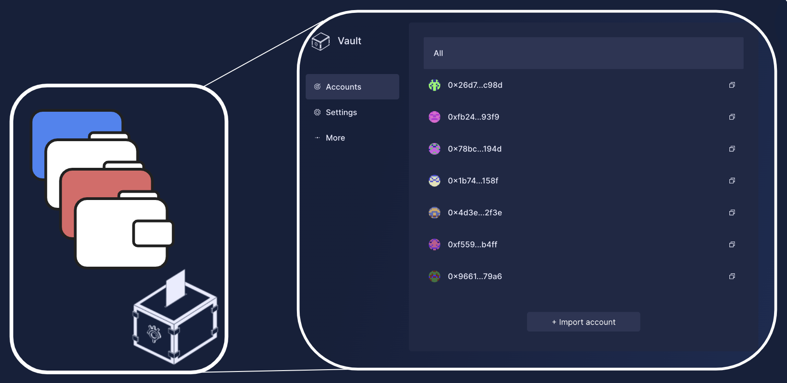
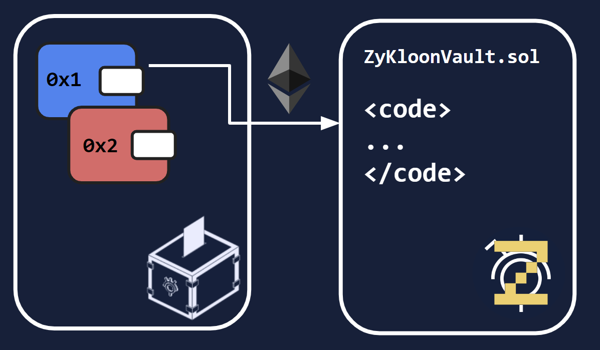
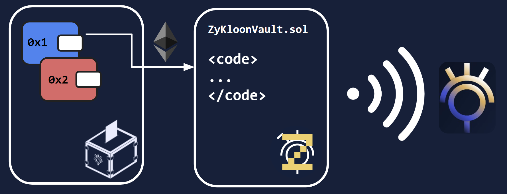
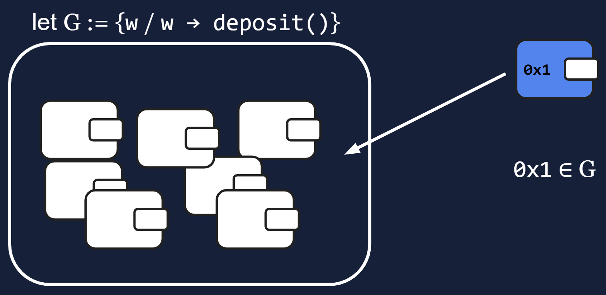
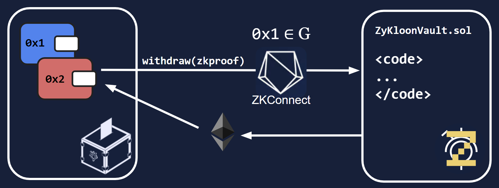

# ZKHack_project


*This project is meant to be used for educational purposes only.*

> **Warning**.
> Check out the [legal disclaimer](LEGAL_DISCLAIMER.md).

# **ZyKloon**

*ZyKloon is a solution that allows to perform anonymous transactions on the Ethereum blockchain.*

*This project was built during the [ZKHack Lisbon Hackaton](https://www.zklisbon.com/) held in Lisbon from March 31 to April 2, 2023.*

## **The problem**

The transparency of the blockchain is a double-edged sword. On the one hand, it allows us to verify the integrity of the transactions and to prevent fraud. On the other hand, it allows anyone to monitor our transactions and to know our identity.

This is a problem for people who want to remain anonymous, for example, when they want to transfer funds from a public and wide known address, used for web3 socials and recognition, to a more private address which is used for personal transactions.

The problem is even more acute under the current economic and political context, where governments are increasingly trying to control the flow of money and to monitor the transactions of their citizens.

## **The solution**

ZyKloon is a solution that allows transfer of Ether between addresses that belong to the same Sismo vault. 

### **Sismo vault**

The initial scenario requires the user to have a Sismo vault with several accounts. 



Next, one can deposit funds into the ZyKloonVault from one of the accounts of the Sismo vault.



### **Sismo Group**

The deposit of funds into the ZyKloonVault creates an event, which is picked up by the `ZyKloon-epoch-depositors` Sismo group.



Therefore, the depositing address is "whitelisted". For more information on how Sismo groups work, please refer to the [Sismo documentation](https://docs.sismo.io/sismo-docs/technical-documentation/zk-badge-protocol/groups).



## **Withdrawal**

To withdraw funds from the ZyKloonVault, one needs to provide a proof of the following statement: "I am in control of an address that belongs to the `ZyKloon-epoch-depositors` Sismo group". With this proof, which is powered by Sismo's ZKConnect feature, funds can be withdrawn from the ZyKloonVault to another address (namely `0x2` in the example below).



> **Notice**
> Deposits are limited to a fixed amount of 0.1 Ether, which is set in the `ZyKloonVault` contract. This is done to simplify accounting.
> In addition, deposits and withdrawal are limited to one per epoch (around 1 week). This is done to simplify the implementation of the Sismo group.

## **Run the app locally**

To run our frontend at `localhost:3000`, first clone the repo

```bash
git clone git@github.com:luksgrin/ZKHack_project.git
```

and then execute the following commands:

```bash
yarn install
yarn dev
```

